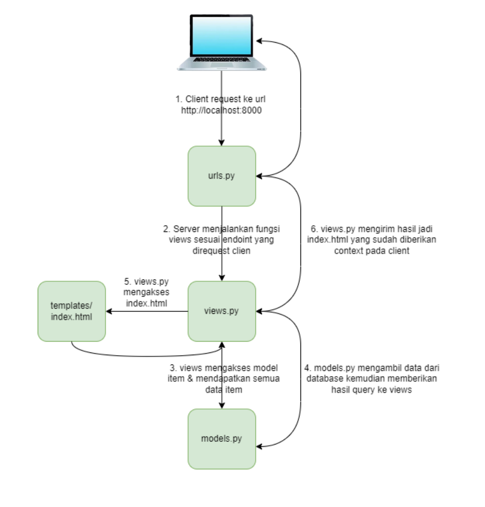

Tugas 2
Untuk mengimplementasikan checklist tugas Django, saya akan membuat sebuah aplikasi untuk mencari NIKM mahasiswa Fasilkom UI angkatan 2019-2020. Berikut adalah langkah-langkah yang saya lakukan:

1. Membuat proyek Django baru

Saya menggunakan perintah django-admin startproject untuk membuat proyek Django baru dengan nama pbpedwin.

django-admin startproject pbpedwin

2. Membuat aplikasi dengan nama main pada proyek tersebut

Saya menggunakan perintah python manage.py startapp main untuk membuat aplikasi baru dengan nama main.

python manage.py startapp main

3. Melakukan routing pada proyek agar dapat menjalankan aplikasi main
Saya menambahkan routing pada proyek Django untuk menjalankan aplikasi main.

Python
from django.contrib import admin
from django.urls import path, include

urlpatterns = [
    path('', include('main.urls')),
    path('admin/', admin.site.urls),
]

4. Membuat model pada aplikasi main dengan nama Item dan memiliki atribut wajib sebagai berikut.

Saya membuat model baru pada aplikasi main dengan nama Item dan memiliki atribut wajib sebagai berikut:

name sebagai nama item dengan tipe CharField.
amount sebagai jumlah item dengan tipe IntegerField.
angkatan sebagai deskripsi item dengan tipe TextField.

from django.db import models

class Product(models.Model):
    name = models.CharField(max_length=255)
    date_added = models.DateField(auto_now_add=True)
    angkatan = models.IntegerField()
    description = models.TextField()

5. Membuat sebuah fungsi pada views.py untuk dikembalikan ke dalam sebuah template HTML yang menampilkan nama aplikasi serta nama dan kelas .

Saya membuat fungsi baru pada file views.py aplikasi main untuk menampilkan nama aplikasi, nama, dan kelas saya.

Python

from django.shortcuts import render

def show_main(request):
    context = {
        'name': 'Edwin',
        'class': 'PBP E'
    }

    return render(request, "main.html", context)

6. Membuat sebuah routing pada urls.py aplikasi main untuk memetakan fungsi yang telah dibuat pada views.py.

Saya menambahkan routing pada file urls.py aplikasi main untuk memetakan fungsi index() pada views.py.

Python
from django.urls import path
from main.views import show_main

app_name = 'main'

urlpatterns = [
    path('', show_main, name='show_main'),
]

//Adaptable error service unavailable
7. Melakukan deployment ke Adaptable terhadap aplikasi yang sudah dibuat sehingga nantinya dapat diakses oleh teman-temanmu melalui Internet.

Saya menggunakan perintah python manage.py collectstatic untuk mengumpulkan semua file statis pada aplikasi dan menyimpannya pada direktori staticfiles/.

python manage.py collectstatic
Kemudian, saya menggunakan perintah python manage.py runserver untuk menjalankan aplikasi Django.

python manage.py runserver
Setelah aplikasi Django berjalan, saya dapat mengaksesnya di alamat http://127.0.0.1:8000/.

Buatlah bagan yang berisi request client ke web aplikasi berbasis Django beserta responnya

Jelaskan apakah itu MVC, MVT, MVVM dan perbedaan dari ketiganya.

MVT adalah singkatan dari Model-View-Template atau seringkali orang mengenalinya dengan nama MTV (Model-Template-View). MVT adalah pola desain atau arsitektur desain yang diikuti Django untuk mengembangkan aplikasi web. Ini sedikit berbeda dari pola desain MVC (Model-View-Controller) yang umum dikenal.

MVT menentukan struktur total dan alur kerja dari aplikasi Django. Dalam arsitektur MVT,
Model pada dasarnya adalah tabel database yang bertugas untuk mengelola data dan diwakili oleh database. View menerima permintaan HTTP dan mengirimkan respons HTTP. Tampilan berinteraksi dengan model dan templat untuk menyelesaikan respons. Template pada dasarnya adalah lapisan front-end dan komponen HTML dinamis dari aplikasi Django.

Perbedaan Utama dengan MVC dan MVVM:
MVT adalah varian dari MVC yang sering digunakan dalam kerangka kerja web seperti Django di Python.

MVC atau Model View Controller adalah sebuah pola desain arsitektur dalam sistem pengembangan website yang terdiri dari tiga bagian yang memiliki peran masing-masing namun saling berkaitan., yaitu: 

Model, bagian yang mengelola dan berhubungan langsung dengan database;
View, bagian yang akan menyajikan tampilan informasi kepada pengguna;
Controller, bagian yang menghubungkan model dan view dalam setiap proses request dari user. Dengan konsep MVC ini, website seakan memiliki bagian yang terpisah dan bisa dikembangkan masing-masing. Maka, proses pembuatan website bisa dilakukan lebih cepat karena developer akan lebih fokus pada pengerjaan salah satu bagian saja. 
Karena dianggap efektif, konsep MVC banyak diterapkan di berbagai framework. Sebagai contoh, di framework PHP terbaik seperti Laravel, CodeIgniter, Symfony, Yii, dan Zend sudah menggunakan konsep ini.

Perbedaan Utama dengan MVT dan MVVM:
MVC adalah pendekatan desain yang umum digunakan di berbagai bahasa pemrograman.
Memisahkan peran masing-masing komponen dengan jelas.

MVVM adalah salah satu arsitektur pembuatan aplikasi berbasis GUI yang berfokus pada pemisahan antara kode untuk logika bisnis dan tampilan aplikasi. Dalam penerapannya, MVVM terbagi atas beberapa layer, yaitu Model, View, dan ViewModel.

Model, Layer ini adalah model atau entitas yang merepresentasikan data yang akan digunakan pada logika bisnis. Umumnya kelas-kelas yang ada di dalamnya berupa POJO atau Plain Old Java Object dan Data Classes jika kita menggunakan Kotlin.
View, tidak seperti layer sebelumnya, layer ini berisi UI dari aplikasi untuk mengatur bagaimana informasi akan ditampilkan. Layer ini akan berisi kelas-kelas, seperti Activity dan Fragment.
ViewModel, Layer yang bertugas untuk berinteraksi dengan model di mana data yang ada akan diteruskan ke layer view.

Perbedaan Utama dengan MVC dan MVT:
MVVM memasukkan ViewModel yang tidak ada di pendekatan lainnya. ViewModel membantu memisahkan logika bisnis dari tampilan dan mengelola state aplikasi dengan lebih efisien.

Jelaskan mengapa kita menggunakan virtual environment? Apakah kita tetap dapat membuat aplikasi web berbasis Django tanpa menggunakan virtual environment?

Virtual environment adalah sebuah wadah untuk menampung pustaka serta modul dalam suatu proyek pekerjaan agar terisolasi. Ketika kita mengerjakan beberapa aplikasi/proyek dengan modul yang sama akan tetapi membutuhkan versi berbeda, disinilah kita membutuhkan virtualenv. Dengan kata lain, Virtual Environment sangat berguna ketika kita membutuhkan dependencies yang berbeda-beda antara project satu dengan lainnya yang berjalan pada satu sistem operasi yang sama

Aplikasi web berbasis Django dapat dibuat tanpa menggunakan virtual environment. Namun, beberapa hal yang perlu diperhatikan jika kita ingin melakukannya:

Jika kita mengembangkan beberapa aplikasi web yang menggunakan versi Python dan paket-paket yang berbeda, dapat terjadi konflik karena aplikasi web kita akan menggunakan versi Python dan paket-paket yang sama dengan sistem operasi kita.

Agar orang lain dapat menjalankan aplikasi web kita, mereka harus memiliki versi Python dan paket-paket yang sama dengan kita. Jika tidak, aplikasi web kita akan lebih sulit untuk dibagikan.

Aplikasi web kita akan menjadi lebih sulit untuk dikelola. Jika kita ingin menginstal paket-paket baru atau memperbarui versi yang sudah ada, kita harus melakukannya dengan hati-hati agar tidak merusak aplikasi web kita.

Secara keseluruhan, penggunaan virtual environment sangat disarankan untuk pengembangan aplikasi web berbasis Django. virtual environment akan membantu kita untuk mengisolasi aplikasi web kita dari aplikasi web lain yang akan mencegah konflik versi Python dan paket-paket. Hal ini mempermudah berbagi aplikasi web kita dengan orang lain karena orang lain hanya perlu memiliki versi Python dan paket-paket yang sama dengan virtual environment kita. Selain itu manfaat dari virtual environment mempermudah pengelolaan aplikasi web kita karena kita dapat menginstal paket-paket baru atau memperbarui versi paket-paket yang sudah ada tanpa khawatir merusak aplikasi web kita.
Kita disarankan untuk menggunakan virtual environment jika kita ingin membuat aplikasi web berbasis Django yang mudah dikelola dan dapat dibagikan dengan orang lain.

Tugas 3

Dalam Django, POST form maupun GET form mengacu pada dua metode berbeda untuk mengirimkan data dari halaman web ke server.

POST Form:

Metode: Data dikirimkan dalam tubuh permintaan HTTP.

Visibilitas: Data tidak terlihat di URL.

Keamanan: Dianggap lebih aman untuk informasi sensitif seperti kata sandi karena data tidak terlihat secara langsung di URL. Namun, ini tidak berarti data terenkripsi. Anda masih harus menggunakan HTTPS untuk komunikasi yang aman.

Ukuran Data: Dapat menangani jumlah data yang besar.

Idempoten: Tidak idempoten, artinya permintaan yang identik dapat memiliki efek yang berbeda.

Penggunaan: Biasanya digunakan saat mengirimkan formulir yang melibatkan informasi sensitif, seperti formulir login, atau saat mengirimkan data yang mungkin mengubah status server.

Penggunaan di Django: Dalam Django, saat Anda mendefinisikan formulir di HTML, biasanya Anda akan menggunakan elemen <form> dengan method="post".

GET Form:

Metode: Data ditambahkan ke URL sebagai parameter kueri.

Visibilitas: Data terlihat di URL.

Keamanan: Kurang aman untuk informasi sensitif karena data terlihat di URL. Hindari menggunakannya untuk kata sandi atau informasi sensitif lainnya.

Ukuran Data: Ada batasan pada jumlah data yang dapat ditangani. URL memiliki batasan panjang maksimum, dan beberapa browser dan server memberlakukan batasan pada panjang URL.

Idempoten: Idempoten, artinya permintaan yang identik akan memiliki efek yang sama.

Penggunaan: Sering digunakan untuk formulir pencarian sederhana, di mana parameter pencarian dapat dienkripsi dalam URL.

Penggunaan di Django: Di Django, Anda menggunakan elemen <form> yang sama di HTML, tetapi dengan method="get".

Pilihan antara menggunakan POST form dan GET form tergantung pada sifat data yang dikirimkan dan persyaratan khusus dari aplikasi Anda. Gunakan POST untuk informasi sensitif dan ketika operasinya tidak idempoten. Gunakan GET untuk operasi di mana parameter dapat dengan mudah dimasukkan dalam URL, seperti pencarian atau penyaringan.

Perbedaan utama antara XML, JSON, dan HTML dalam konteks pengiriman data adalah sebagai berikut:

XML (eXtensible Markup Language) adalah format data yang berbasis teks dan dapat dibaca mesin. XML digunakan untuk mendefinisikan struktur data yang kompleks. XML dapat digunakan untuk mengirim berbagai jenis data, termasuk data yang terstruktur, semi-terstruktur, dan tidak terstruktur.

JSON (JavaScript Object Notation) adalah format data yang berbasis teks dan mudah dibaca manusia. JSON digunakan untuk mewakili data dalam bentuk objek dan array. JSON sering digunakan untuk mengirim data dari aplikasi web ke server.

HTML (Hypertext Markup Language) adalah format data yang berbasis teks dan digunakan untuk membuat halaman web. HTML tidak digunakan untuk mengirim data, tetapi dapat digunakan untuk menampilkan data yang dikirim dalam format XML atau JSON.

XML adalah format data yang serbaguna yang dapat digunakan untuk mengirim berbagai jenis data. JSON adalah format data yang mudah dibaca manusia yang sering digunakan untuk mengirim data dari aplikasi web ke server. HTML adalah format data yang digunakan untuk membuat halaman web, tetapi tidak digunakan untuk mengirim data.

JSON sering digunakan dalam pertukaran data antara aplikasi web modern karena beberapa alasan, yaitu:

Kompatibilitas: JSON adalah format data yang populer dan didukung oleh berbagai bahasa pemrograman dan platform.
Kemudahan penggunaan: JSON mudah dibaca dan ditulis oleh manusia, sehingga memudahkan pengembang untuk memahami dan bekerja dengan data yang dipertukarkan.
Kinerja: JSON relatif kecil dan mudah diurai, sehingga tidak membebani jaringan atau server.
Efisiensi: JSON dapat digunakan untuk mewakili berbagai jenis data, termasuk data yang terstruktur, semi-terstruktur, dan tidak terstruktur.

Berikut adalah beberapa contoh penggunaan JSON dalam pertukaran data antara aplikasi web modern:

Mentransfer data dari aplikasi web ke server: JSON sering digunakan untuk mentransfer data dari aplikasi web ke server, seperti data formulir, data pengguna, atau data produk.
Mentransfer data dari server ke aplikasi web: JSON juga sering digunakan untuk mentransfer data dari server ke aplikasi web, seperti data hasil pencarian, data berita, atau data produk.
Mentransfer data antar aplikasi web: JSON dapat digunakan untuk mentransfer data antar aplikasi web, seperti data yang digunakan untuk sinkronisasi data atau untuk berbagi data.

Secara umum, JSON adalah format data yang ideal untuk pertukaran data antara aplikasi web modern. JSON mudah digunakan, efisien, dan kompatibel dengan berbagai bahasa pemrograman dan platform.

Untuk mengimplementasikan checklist tugas Django untuk Implementasi Form dan Data Delivery pada Django, saya mengganti tema website saya yang sebelumnya membuat sebuah aplikasi untuk mencari NIKM mahasiswa Fasilkom UI angkatan 2019-2020, menjadi tempat untuk membeli poster. Berikut adalah langkah-langkah yang saya lakukan:

Langkah 0: Ubah berkas main.html menjadi sesuai yang diinginkan

Langkah 1: Mengatur Routing dari main/ ke /

Buka file urls.py yang ada dalam folder pbpedwin
Ubah path dari main/ menjadi '' pada urlpatterns.
python

Langkah 2: Implementasi Skeleton sebagai Kerangka Views

Buat folder templates di dalam root folder.
Buat file HTML baru bernama base.html di dalam folder templates.
Isi file base.html dengan kode yang diberikan.

Langkah 3: Membuat Form Input Data dan Menampilkan Data Produk Pada HTML

Buat file forms.py di dalam folder main.
Tambahkan kode untuk membuat form ProductForm yang menggunakan model Product.
python
Buka file views.py di dalam folder main.
Tambahkan import yang diperlukan dan buat fungsi create_product.

Langkah 4: Menampilkan Data Produk Pada Halaman Utama

Buka file views.py di dalam folder main.
Ubah fungsi show_main untuk mengambil seluruh objek Product dari database.
python

Langkah 5: Mengembalikan Data dalam Bentuk XML

Buka file views.py di dalam folder main.
Tambahkan import dan buat fungsi show_xml untuk mengembalikan data dalam bentuk XML.

Langkah 6: Mengembalikan Data dalam Bentuk JSON

Buka file views.py di dalam folder main.
Tambahkan import dan buat fungsi show_json untuk mengembalikan data dalam bentuk JSON.

Langkah 7: Mengembalikan Data Berdasarkan ID dalam Bentuk XML dan JSON

Buka file views.py di dalam folder main.
Tambahkan import dan buat fungsi show_xml_by_id dan show_json_by_id untuk mengembalikan data berdasarkan ID dalam bentuk XML dan JSON.

Langkah 8: Penggunaan Postman Sebagai Data Viewer

Pastikan server berjalan dengan perintah python manage.py runserver.
Buka Postman dan buat request GET dengan URL http://localhost:8000/xml atau http://localhost:8000/json untuk menguji pengembalian data.

Langkah 9: Penutup

Pastikan struktur direktori lokal sudah benar.
Lakukan add, commit, dan push untuk memperbarui repositori GitHub.

Lampiran Screenshot Postman

.png>)

.png>)

TUGAS 4

1. Apa itu Django UserCreationForm, dan jelaskan apa kelebihan dan kekurangannya?
Django UserCreationForm adalah kelas form yang digunakan untuk membuat pengguna baru di Django. Kelas ini menyediakan beberapa kelebihan, yaitu:
    -Mudah digunakan, karena sudah menyediakan semua bidang yang diperlukan untuk membuat pengguna baru, seperti nama pengguna, email, dan kata sandi.
    -Fleksibel, karena dapat disesuaikan untuk memenuhi kebutuhan spesifik aplikasi.
    -Aman, karena menggunakan metode hashing untuk melindungi kata sandi pengguna.

Kekurangan dari Django UserCreationForm adalah:
    -Tidak dapat digunakan untuk membuat pengguna dengan peran khusus, seperti administrator atau moderator.
    -Tidak dapat digunakan untuk membuat pengguna dengan data tambahan, seperti alamat atau nomor telepon.

2. Apa perbedaan antara autentikasi dan otorisasi dalam konteks Django, dan mengapa keduanya penting?
Autentikasi adalah proses mengidentifikasi pengguna, sedangkan otorisasi adalah proses menentukan apakah pengguna memiliki izin untuk mengakses suatu sumber daya. Dalam konteks Django, autentikasi digunakan untuk memastikan bahwa pengguna yang mengakses aplikasi adalah pengguna yang benar. Otorisasi digunakan untuk menentukan apakah pengguna memiliki izin untuk mengakses halaman atau fitur tertentu Kedua proses ini penting karena membantu melindungi aplikasi dari akses yang tidak sah.

3. Apa itu cookies dalam konteks aplikasi web, dan bagaimana Django menggunakan cookies untuk mengelola data sesi pengguna?
Cookies adalah file kecil yang disimpan di perangkat pengguna ketika mereka mengunjungi sebuah situs web. Cookies berisi informasi khusus yang memungkinkan situs web untuk mengenali dan "mengingat" pengguna dari kunjungan ke kunjungan. Informasi ini dapat mencakup preferensi pengguna, riwayat aktivitas, atau data sesi.
Django menggunakan cookies untuk mengelola sesi pengguna. Saat seorang pengguna masuk atau berinteraksi dengan situs web, Django akan membuat sebuah cookie yang berisi ID unik untuk sesi pengguna tersebut. Cookie ini kemudian dikirim ke browser pengguna. Setiap kali pengguna melakukan permintaan selanjutnya ke situs web, browser akan mengirimkan cookie ini kembali kepada server Django. Dengan memanfaatkan ID sesi dalam cookie, Django dapat mengidentifikasi dan mengelola sesi pengguna dengan tepat.

4. Apakah penggunaan cookies aman secara default dalam pengembangan web, atau apakah ada risiko potensial yang harus diwaspadai?
Penggunaan cookies dalam pengembangan web memiliki beberapa risiko potensial yang perlu diwaspadai. Meskipun secara default, penggunaan cookies dianggap aman, tetapi ada beberapa masalah keamanan yang dapat timbul terkait dengan cookies seperti berikut:
    Pelanggaran privasi: Cookies dapat digunakan untuk melacak informasi pengguna, seperti preferensi, riwayat penelusuran, atau data pribadi lainnya. Jika cookies ini jatuh ke tangan yang salah, dapat terjadi pelanggaran privasi yang serius. Oleh karena itu, penting untuk mempertimbangkan jenis data yang disimpan dalam cookies dan memastikan kebijakan privasi yang ketat.

    Serangan XSS (Cross-Site Scripting): Cookies dapat menjadi target serangan XSS jika tidak diimplementasikan dengan benar. Serangan XSS dapat memungkinkan penyerang menyisipkan skrip berbahaya ke halaman web yang dapat mencuri informasi pengguna atau melakukan tindakan berbahaya lainnya. Untuk mengurangi risiko ini, pastikan untuk melakukan sanitasi data sebelum menyimpannya dalam cookies dan selalu melakukan validasi input pengguna.

    Serangan CSRF (Cross-Site Request Forgery): Cookies juga dapat digunakan dalam serangan CSRF, di mana penyerang mencoba memanipulasi aksi yang dilakukan oleh pengguna yang telah diautentikasi. Dalam serangan ini, penyerang memanfaatkan cookies yang disimpan pada peramban pengguna untuk melakukan tindakan yang tidak dikehendaki oleh pengguna. Untuk mengurangi risiko ini, pastikan untuk mengimplementasikan langkah-langkah keamanan seperti token CSRF dalam aplikasi web Anda.

    Penggunaan cookies yang tidak aman: Penggunaan cookies dengan atribut yang tidak aman dapat meningkatkan risiko keamanan. Misalnya, jika cookies dikirim melalui protokol HTTP biasa, data tersebut dapat dengan mudah diintersep oleh penyerang. Oleh karena itu, pastikan untuk mengatur atribut "Secure" pada cookies jika situs web Anda menggunakan protokol HTTPS untuk komunikasi yang aman.

5. Jelaskan bagaimana cara kamu mengimplementasikan checklist di atas secara step-by-step (bukan hanya sekadar mengikuti tutorial).

1. Membuat Formulir Registrasi

    - Buka `views.py` pada subdirektori `main`.
    - Impor `UserCreationForm` dan `messages`.
    - Buat fungsi `register` dengan parameter `request`.
    - Dalam fungsi `register`, buat formulir `UserCreationForm`.
    - Di dalam blok `if request.method == "POST"`, periksa apakah formulir valid, simpan data pengguna, dan tampilkan pesan berhasil jika registrasi sukses.

2. Membuat Template Registrasi

    - Buat berkas `register.html` pada folder `main/templates`.
    - Gunakan formulir `POST` untuk mengirimkan data registrasi.
    - Gunakan tag templat `` untuk keamanan formulir.
    - Tampilkan formulir pendaftaran dengan `{{ form.as_table }}`.
    - Tampilkan pesan kesalahan jika ada.

3. Membuat Fungsi Login

    - Buka `views.py` pada subdirektori `main`.
    - Impor `authenticate` dan `login`.
    - Buat fungsi `login_user` dengan parameter `request`.
    - Dalam fungsi `login_user`, periksa apakah pengguna berhasil terotentikasi, jika ya, lakukan login dan atur cookie `last_login`.

4. Membuat Template Login

    - Buat berkas `login.html` pada folder `main/templates`.
    - Gunakan formulir `POST` untuk mengirimkan data login.
    - Gunakan tag templat `` untuk keamanan formulir.
    - Tampilkan formulir login dengan kolom `username` dan `password`.
    - Tampilkan pesan kesalahan jika ada.

5. Membuat Fungsi Logout

    - Buka `views.py` pada subdirektori `main`.
    - Impor `logout`.
    - Buat fungsi `logout_user` dengan parameter `request`.
    - Dalam fungsi `logout_user`, lakukan logout dan hapus cookie `last_login`.

6. Menambahkan Tombol Logout di Halaman Utama

    - Buka berkas `main.html` pada folder `main/templates`.
    - Tambahkan tombol untuk logout dengan menggunakan `<a>` dan `<button>`.

7. Menggunakan Cookies

    - Dalam fungsi `login_user`, set cookie `last_login` menggunakan `response.set_cookie`.
    - Dalam fungsi `show_main`, ambil nilai cookie `last_login` dari `request.COOKIES`.

8. Menghubungkan Model Product dengan User

    - Buka `models.py` pada subdirektori `main`.
    - Impor model `User`.
    - Tambahkan relasi `ForeignKey` pada model `Product` untuk menghubungkannya dengan `User`.
    - Dalam fungsi `create_product`, set `product.user` dengan `request.user`.
    - Dalam fungsi `show_main`, filter produk berdasarkan pengguna yang terotentikasi.

9. Migrasi dan Menerapkan Perubahan Model

    - Jalankan `python manage.py makemigrations` dan pilih opsi untuk menetapkan nilai default.
    - Jalankan `python manage.py migrate` untuk menerapkan migrasi.

10. Menambahkan Akses Terbatas ke Halaman Utama

    - Impor `login_required` dari `django.contrib.auth.decorators`.
    - Tambahkan dekorator `@login_required` di atas fungsi `show_main`.

11.  Menampilkan Informasi Terakhir Login di Halaman Utama

    - Dalam fungsi `show_main`, kirim informasi terakhir login sebagai bagian dari konteks.

12. Menampilkan Informasi Terakhir Login di Template

    - Tambahkan kode untuk menampilkan informasi terakhir login di berkas `main.html`.

Tugas 5

1. Jelaskan manfaat dari setiap element selector dan kapan waktu yang tepat untuk menggunakannya.

Manfaat dan Waktu yang Tepat Menggunakan Selector CSS

Selector CSS digunakan untuk menarget elemen HTML pada halaman web yang ingin kita style. Ada berbagai jenis selector CSS yang tersedia, yang memungkinkan kita untuk memilih elemen dengan presisi tinggi untuk diberi style.

Ada beberapa jenis selector yang umum digunakan:

Type Selector: Menarget elemen berdasarkan nama tag-nya. Misalnya, h1 {color: red;} akan menerapkan warna merah ke semua elemen h1.
Class Selector: Menarget elemen yang memiliki nilai tertentu untuk atribut class-nya. Misalnya, .box {background-color: blue;} akan menerapkan background biru ke semua elemen dengan class "box" .
ID Selector: Menarget elemen yang memiliki nilai tertentu untuk atribut id-nya. Misalnya, #unique {font-size: 16px;} akan menerapkan ukuran font 16px ke elemen dengan ID "unique" 
Attribute Selector: Menarget elemen berdasarkan atribut dan nilai atribut tertentu. Misalnya, a[title] {text-decoration: none;} akan menghapus underline pada semua elemen a yang memiliki atribut title.

Pilih selector berdasarkan kebutuhan. Gunakan type selector untuk mengubah style semua elemen dengan tag yang sama. Gunakan class selector untuk mengubah style elemen tertentu yang memiliki class yang sama. Gunakan ID selector untuk mengubah style satu elemen unik dengan ID tertentu. Gunakan attribute selector untuk mengubah style elemen berdasarkan atribut dan nilai atributnya.

2. Jelaskan HTML5 Tag yang kamu ketahui.
Tag HTML5 yang Umum Digunakan

<header>: Digunakan untuk navigasi link atau konten pendahuluan 
<section>: Mendefinisikan bagian di mana tidak ada elemen HTML semantik yang lebih spesifik untuk mewakilinya
<article>: Mewakili bagian independen dari konten yang masuk akal sendiri 
<aside>: Digunakan untuk konten yang agak terpisah dari konten sekitarnya dan bisa dianggap independen 
<footer>: Digunakan untuk footer dari suatu bagian atau seluruh halaman 
<em> dan <i>: Digunakan untuk menekankan teks 
<label> dan <textarea>: Digunakan dalam form input
<audio>: Digunakan untuk memasukkan file audio ke halaman web 
<iframe>: Digunakan untuk menyertakan dokumen HTML independen ke dalam dokumen HTML saat ini

3.  Jelaskan perbedaan antara margin dan padding

Perbedaan antara Margin dan Padding

Margin dan padding adalah dua metode dalam CSS yang digunakan untuk mengatur jarak antara elemen. Margin berada di luar batas elemen dan tidak dihitung sebagai bagian dari elemen itu sendiri, sedangkan padding berada di dalam batas elemen dan dihitung sebagai bagian dari elemen itu sendiri.

Margin: Merupakan ruang di sekitar elemen. Margin digunakan untuk menggerakkan elemen naik atau turun pada halaman serta ke kiri atau ke kanan. Margin bening dan tidak memiliki warna latar belakang. Margin digunakan untuk membuat jarak, mendorong elemen lain menjauh

Padding: Merupakan ruang antara elemen dan konten terkait di dalamnya. Padding menentukan bagaimana elemen terlihat dan duduk dalam suatu container. Padding bisa dipengaruhi oleh warna latar belakang karena membersihkan area di sekitar konten. Untuk membuat jarak, padding bisa memperbesar ukuran elemen atau mengecilkan konten di dalamnya 

4. Jelaskan perbedaan antara framework CSS Tailwind dan Bootstrap. Kapan sebaiknya kita menggunakan Bootstrap daripada Tailwind, dan sebaliknya?

Perbedaan antara Framework CSS Tailwind dan Bootstrap

Tailwind dan Bootstrap adalah dua framework CSS yang populer. Keduanya memiliki perbedaan yang signifikan dalam hal pendekatan desain, kustomisasi, dan ukuran file.

Bootstrap: Framework ini menggunakan pendekatan berbasis komponen, yang berarti telah memiliki kumpulan komponen siap pakai (seperti tombol, kartu, navbar, dan lainnya) yang bisa langsung digunakan. Bootstrap juga mendukung JavaScript untuk komponen seperti modal dan tooltip. Bootstrap memiliki ukuran file yang lebih besar dibandingkan Tailwind, tetapi bisa diminimalkan menggunakan Bootstrap customizer atau hanya mengimpor komponen yang diperlukan 

Tailwind: Berbeda dengan Bootstrap, Tailwind adalah sebuah utility-first CSS framework. Sebaliknya, Tailwind menyediakan kelas utilitas rendah yang memungkinkan kita membangun desain yang unik tanpa meninggalkan HTML. Tailwind tidak memiliki komponen siap pakai dan tidak mendukung JavaScript. Meskipun memiliki ukuran file yang lebih kecil, Tailwind memerlukan konfigurasi lebih untuk memulai dibandingkan Bootstrap. 

Pilih Bootstrap jika kita membutuhkan komponen siap pakai dan mendukung JavaScript, atau jika kita ingin membangun prototipe dengan cepat. Pilih Tailwind jika kita menginginkan kontrol lebih atas desain kita, atau jika kita berfokus pada ukuran file yang kecil dan performa yang tinggi.

5. Jelaskan bagaimana cara kamu mengimplementasikan checklist di atas secara step-by-step (bukan hanya sekadar mengikuti tutorial).

Awalan
Buka project django pbpedwin, lalu buka file base.html yang telah dibuat sebelumnya pada templates folder yang berada di root project kalian. Didalam templates/base.html, tambahkan tag <meta name="viewport"> agar halaman web kita dapat menyesuaikan ukuran dan perilaku perangkat mobile (apabila belum). Tambahkan script untuk Bootstrap CSS dan juga JS juga. Nantinya akan ada banyak html yang mewariskan fitur dari base.html.

Langkah 1: Menambahkan Navbar dengan Bootstrap

Buka file main.html pada editor teks atau IDE kita.
Temukan bagian yang dimulai dengan <nav class="navbar navbar-expand-lg bg-body-tertiary"> dan akhiri dengan </nav>.
Dalam Navbar, kita dapat menyesuaikan elemen-elemennya sesuai keinginan, seperti mengubah teks "Navbar" menjadi judul yang diinginkan, menambah atau mengubah item navigasi, dan sebagainya. Navbar ini memiliki tombol navigasi yang dapat di-toggle pada perangkat mobile.

Bootstrap kelas yang digunakan:
.navbar: Membungkus seluruh Navbar.
.navbar-brand: Membuat sebuah link dengan teks "Navbar" di dalam Navbar.
.navbar-toggler: Tombol toggle untuk versi mobile.
.navbar-collapse: Area yang akan ditoggle pada versi mobile.
.navbar-nav: Daftar navigasi.
.nav-item: Item dalam daftar navigasi.
.nav-link: Link di dalam item navigasi.
.dropdown: Membuat dropdown.
.dropdown-menu: Menu dropdown.

Langkah 2: Header "WINSTER"
Temukan bagian dengan class .header.
Sesuaikan teks dan desain header sesuai keinginan kita. Kita dapat menambahkan elemen HTML tambahan atau mengubah tata letak sesuai kebutuhan.

Langkah 3: Gambar
Temukan bagian dengan class .image.
Tambahkan tag  untuk menampilkan gambar yang diinginkan di dalam div ini.

Langkah 4: Tabel Produk
Temukan bagian dengan class .product-table.
Sesuaikan tampilan tabel atau kontennya sesuai keinginan kita. kita dapat menambahkan atau menghapus kolom, mengubah format tampilan, dan sebagainya.

Langkah 5: Login Info
Temukan bagian dengan class .login-info.
Sesuaikan informasi atau tampilan sesuai keinginan kita. kita dapat menambahkan atau mengubah teks, dan menyesuaikan desain elemen.

Langkah 6: Tombol-tombol
Temukan bagian dengan class .buttons.
Sesuaikan tombol-tombol "Add New Product" dan "Logout" sesuai keinginan kita. kita dapat menambahkan atau mengubah teks, dan menyesuaikan desain tombol.

Langkah 7: CSS Kustom
Temukan bagian di akhir file dengan tag <style>.
Di dalam tag <style>, kita dapat menambahkan atau mengubah properti CSS untuk melakukan kustomisasi tambahan sesuai keinginan kita.

Langkah 8: Background Gambar
Di dalam tag <style>, temukan atau tambahkan aturan CSS untuk mengatur gambar latar belakang dengan properti background-image. Kalau saya memakai gambar yang saya upload terlebih dahulu lewat Facebook.

Langkah 9: Kustomisasi Tabel Produk
Di dalam tag <style>, temukan atau tambahkan aturan CSS untuk melakukan kustomisasi pada tampilan kartu produk dengan menggunakan kelas .product-card dan .product-info.

Langkah 10: Pengaturan Warna Kolom Amount
Di dalam tag <style>, temukan atau tambahkan aturan CSS untuk mengubah warna teks pada kolom "amount" dengan menggunakan kelas .amount.

Langkah 11: Penambahan Tombol Edit dan Hapus
Temukan bagian dalam tabel produk yang mencakup tombol "Edit" dan "Delete".
Sesuaikan atau tambahkan URL yang benar sesuai dengan halaman edit dan halaman hapus pada atribut href.

Langkah 12: Edit bagian Navbar
Pastikan bahwa halaman edit, dropdown menu, dan tombol "Search" sesuai dengan kebutuhan kita.

Langkah  13: Menambahkan Card
Temukan atau buat elemen di mana kita ingin menampilkan kartu-kartu produk. Buat blok atau iterasi di mana produk kita akan ditampilkan. Lakukan modifikasi sesuai sintaks untuk membuat Card

Contoh:

  

    
    

      <h5 class="card-title">{{ product.name }}</h5>
      
{{ product.description }}

      
{{ product.amount }}

      
{{ product.date_added }}

      <a href="" class="btn btn-primary">Edit</a>
      <a href="" class="btn btn-danger">Delete</a>
    

  



Tugas 6 
1. Jelaskan perbedaan antara asynchronous programming dengan synchronous programming.
Perbedaan antara asynchronous programming dan synchronous programming terletak pada cara mereka mengeksekusi instruksi. Dalam synchronous programming, kode dieksekusi secara berurutan dari atas ke bawah. Setiap operasi harus selesai sebelum yang berikutnya dimulai. Jika suatu operasi memerlukan waktu yang lama (misalnya, permintaan ke server), seluruh aplikasi akan terhenti atau "diblokir" sampai operasi tersebut selesai. Sebaliknya, asynchronous programming memungkinkan operasi yang memerlukan waktu lama untuk diproses di latar belakang, sementara kode lain tetap berjalan. Ini menghindari "pemblokiran" dan membuat aplikasi lebih responsif.

2. Dalam penerapan JavaScript dan AJAX, terdapat penerapan paradigma event-driven programming. Jelaskan maksud dari paradigma tersebut dan sebutkan salah satu contoh penerapannya pada tugas ini.
Paradigma event-driven programming adalah sebuah pendekatan pemrograman di mana program merespons peristiwa atau kejadian yang terjadi selama eksekusi program. Pada paradigma ini, program tidak berjalan secara linear dari awal hingga akhir, melainkan menunggu peristiwa tertentu untuk terjadi dan menanggapi peristiwa tersebut.

Contoh Penerapannya pada Tugas Ini:
Pada tugas ini, paradigma event-driven terlihat dalam penggunaan event handler seperti addEventListener pada tombol-tombol atau elemen-elemen interaktif lainnya.
Contohnya adalah tombol "Add Product by AJAX" yang mengaktifkan modal. Saat tombol ini ditekan, sebuah event dihasilkan dan JavaScript menanggapi event tersebut untuk membuka modal.

3. Jelaskan penerapan asynchronous programming pada AJAX.
Asynchronous programming digunakan dalam AJAX untuk menghindari pemblokiran yang disebabkan oleh permintaan ke server. Dalam konteks AJAX, asynchronous berarti bahwa permintaan ke server dilakukan di latar belakang sementara kode lain tetap berjalan. Ketika data dari server diterima, sebuah fungsi callback dipanggil untuk memproses data tersebut. Ini memungkinkan aplikasi untuk tetap responsif, bahkan saat menunggu data dari server.

4. Pada PBP kali ini, penerapan AJAX dilakukan dengan menggunakan Fetch API daripada library jQuery. Bandingkanlah kedua teknologi tersebut dan tuliskan pendapat kamu teknologi manakah yang lebih baik untuk digunakan.
Fetch API dan jQuery AJAX adalah dua teknologi yang digunakan untuk membuat permintaan AJAX. Keduanya mendukung asynchronous programming, tetapi ada beberapa perbedaan penting. Fetch API adalah antarmuka bawaan JavaScript yang lebih modern dan fleksibel. Ia menggunakan Promises, yang membuat penanganan permintaan asynchronous lebih mudah dan lebih intuitif. Di sisi lain, jQuery AJAX telah ada lebih lama dan memiliki dukungan yang lebih luas di antara browser lama. Namun, jQuery AJAX menggunakan callback, yang bisa menjadi lebih sulit untuk dikelola ketika permintaan menjadi lebih kompleks.
Saya lebih memilih Fetch API karena lebih modern dan mengikuti standar ES6 seperti Promises dan async/await. Namun, keputusan tergantung pada kebutuhan proyek dan dukungan browser yang ditargetkan. Jika kita perlu mendukung browser lama, jQuery AJAX dapat menjadi pilihan yang lebih baik
5. Jelaskan bagaimana cara kamu mengimplementasikan checklist di atas secara step-by-step (bukan hanya sekadar mengikuti tutorial).

Langkah 1: Membuat Fungsi untuk Mengembalikan Data JSON
Buka berkas views.py dalam folder main.
Tambahkan fungsi get_product_json sesuai dengan instruksi berikut:

Langkah 2: Membuat Fungsi untuk Menambahkan Produk dengan AJAX
Buka berkas views.py.
Tambahkan import csrf_exempt di bagian atas berkas:
Tambahkan dekorator @csrf_exempt di atas fungsi add_product_ajax:

Langkah 3: Menambahkan Routing Untuk Fungsi get_product_json dan add_product_ajax
Buka berkas urls.py dalam folder main.
Tambahkan path URL untuk kedua fungsi tersebut di dalam urlpatterns:

Langkah 4: Menampilkan Data Produk dengan Fetch() API
Buka berkas main.html dalam folder main/templates.
Hapus bagian kode table yang sudah Anda buat pada tutorial sebelumnya.
Gantikan dengan struktur tabel berikut:
Buat juga fungsi refreshProducts() untuk me-refresh data produk secara asinkron

Langkah 5: Membuat Modal Sebagai Form untuk Menambahkan Produk
Tambahkan kode modal Bootstrap ke dalam berkas Anda.

Langkah 6: Menambahkan Data Produk dengan AJAX
Buat fungsi addProduct() dalam blok <script>:
Tambahkan onclick event pada tombol "Add Product" di dalam modal:
